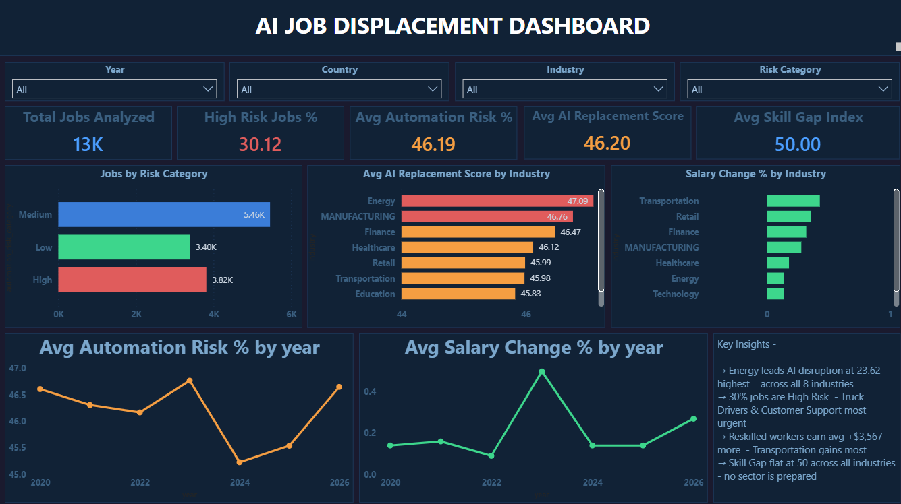

# AI Job Displacement & Reskilling Analytics
## 🔗 Live Dashboard

**[View Interactive Dashboard →](https://app.powerbi.com/view?r=eyJrIjoiZTg4ZjcwMjctODJlOS00Y2QzLWIxZWQtNWU5OWI1YWFlODY0IiwidCI6IjgxNzlhMDY3LTM5NGYtNDI2ZS05M2RhLTMzZmM4MjJmYTgxNSJ9&pageName=f39879b19818099e3780)**

*Published via Power BI Service — no login required, fully interactive*

**End-to-end workforce analytics dashboard built with SQL Server, Power BI, and Python**



---

## Business Problem

As AI adoption accelerates across industries, organisations and policymakers face a critical visibility gap — they know disruption is happening but cannot quantify where, how fast, or who is most at risk. Without structured analysis, workforce planners have no data to answer:

- Which industries and job roles face the highest automation replacement risk
- Whether salary outcomes after reskilling are actually positive — or are workers earning less
- Which roles have the largest skill gaps and the most urgent reskilling needs
- How AI disruption intensity varies across countries and sectors
- Whether skill demand is growing fast enough to absorb displaced workers
- Which combinations of industry and risk category warrant immediate policy intervention

The result is reactive workforce planning — reskilling programmes get funded based on assumption rather than evidence, and displaced workers fall through the gaps.

---

## Solution

An end-to-end analytics dashboard that gives workforce analysts and HR strategists a single view of AI's impact on global employment — tracking automation risk, salary outcomes, skill gaps, and reskilling urgency across 7 years of data (2020–2026) spanning 9 countries and 8 industries.

**Key questions the dashboard answers:**
- Which industries have the highest AI replacement scores and disruption intensity
- What percentage of jobs fall into High / Medium / Low automation risk categories
- Whether reskilling translates into actual salary improvement — by industry and job role
- Which roles face the most critical skill transition pressure
- How skill demand growth has trended over time
- Where the intersection of high skill gap and high urgency creates the most acute need

---

## Tech Stack

| Tool | Purpose |
|------|---------|
| Python (Pandas, NumPy) | Data quality engineering — introducing and validating realistic data issues |
| SQL Server (SSMS) | Schema design, data loading, cleaning, transformation, derived column creation |
| Power BI + DAX | Interactive 4-page dashboard with 15+ measures |
| Power Query | Final type corrections and data preparation |

---

## Dataset

Dataset compiled from publicly available labor market research and industry reports on AI adoption trends across global workforces, structured to reflect realistic employment patterns across sectors and geographies.

**1 table — 15,000 records (15,411 with introduced data quality issues):**

| Table | Rows | Description |
|-------|------|-------------|
| ai_jobs_dirty | 15,411 | Core fact table — one row per job record with automation, salary, skill, and reskilling metrics |

**Coverage:**
- **9 countries:** USA, UK, Canada, Germany, Australia, Japan, India, Singapore, Brazil
- **8 industries:** Technology, Finance, Manufacturing, Healthcare, Retail, Education, Transportation, Energy
- **10 job roles:** Data Analyst, Software Engineer, Financial Analyst, Accountant, Teacher, Customer Support Rep, Marketing Specialist, HR Manager, Mechanical Engineer, Truck Driver
- **7 years:** 2020–2026

**Data quality issues engineered for realistic cleaning practice:**

| Issue Type | Details |
|-----------|---------|
| NULLs | 814 null countries, 946 null salaries, 1,212 null risk categories, 1,005 null education levels |
| Duplicates | 411 duplicate rows introduced (~2.7% of dataset) |
| Inconsistent casing | 80% of country and industry values randomised across title/lower/UPPER case |
| Salary outliers | 1% of salary records set to extreme values ($1M–$5M high, negative low) |
| Invalid category values | automation_risk_category corrupted to 'MED', 'hIGH', 'Lowww', 'HIGH!' etc |
| Year string errors | year field corrupted with letter-O substitutions ('2O21', '2O23' etc) |

---

## Project Structure

```
AI-Job-Displacement-Reskilling-Dashboard/
│
├── CSV/
│   ├── ai_job_replacement_2020_2026_v2.csv   ← clean source data
│   └── ai_jobs_dirty.csv                     ← engineered dirty data
│
├── Python/
│   └── make_data_dirty.py
│
├── SQL/
│   └── cleaning_queries.sql
│
├── screenshots/
│   ├── overview.png
│   ├── AI risk analysis.png
│   ├── salary analysis.png
│   └── skills and reskilling.png
│
└── README.md
```

---

## Python — Data Quality Engineering

`make_data_dirty.py` programmatically introduces 6 categories of data quality issues into the clean source dataset to simulate the kind of data engineers encounter from real operational systems.

```python
# Duplicate injection — 2–3% of records
n_dup = np.random.randint(int(0.02 * len(df)), int(0.03 * len(df)))
dup_indices = np.random.choice(df.index, n_dup, replace=False)
df_dirty = pd.concat([df] + [df.loc[dup_indices]], ignore_index=True)

# Year string corruption — letter O substituted for zero
err_vals = ['2O20', '2O21', '2O22', '2O23', '2O24', '2O25', '2O26']
df_dirty.loc[err_idx, 'year'] = np.random.choice(err_vals, len(err_idx))

# Salary outlier injection — high and negative extremes
df_dirty.loc[out_idx[:half], col] = np.random.uniform(1000000, 5000000, half)
df_dirty.loc[out_idx[half:], col] = np.random.uniform(-10000, 0, len(out_idx) - half)
```

**Verification output confirms:**
- Shape: (15411, 20)
- NULLs across 4 target columns confirmed
- 50 exact duplicates detected
- Year corruption present across all 7 year values

---

## SQL Scripts

`cleaning_queries.sql` is structured in 5 sections and handles all data engineering before Power BI.

**Section 01 — Schema Creation**
- CREATE TABLE with correct data types for all 20 columns
- Intentionally no PRIMARY KEY constraint — mirrors dirty source data
- Column types chosen to handle dirty values (VARCHAR for year, DECIMAL for scores)

**Section 02 — Data Load**
- BULK INSERT with UTF-8 encoding (CODEPAGE 65001)
- ROWTERMINATOR handles both Windows and Unix line endings
- Verification queries confirm row count and dirty data presence

**Section 03 — Cleaning**
- Deduplication using ROW_NUMBER() window function with PARTITION BY job_id
- Casing standardisation — UPPER(LEFT()) + LOWER(SUBSTRING()) pattern for title case
- automation_risk_category fix — CASE statement normalises all 6 corrupt variants to High/Medium/Low
- Year fix — CASE statement corrects all letter-O substitutions to valid integers
- NULL handling — country NULLs filled with mode using TOP 1 subquery; education NULLs filled with most common value

**Section 04 — Derived Columns**
- `salary_trend` — VARCHAR column derived from salary_change_percent thresholds
  - Positive: change > 2%, Negative: change < -2%, Stable: between
- `education_label` — VARCHAR column mapping numeric education levels (1–5) to readable labels (High School → PhD)

**Section 05 — Verification**
- Final SELECT confirms zero remaining NULLs in cleaned columns
- COUNT DISTINCT checks on risk categories (should be exactly 3)
- Sample output confirms salary_trend and education_label populated correctly

---

## Dashboard — 4 Pages

### Page 1 — Overview

Entry point for any viewer — full picture of AI displacement at a glance.


**KPI Cards:** Total Jobs Analyzed · High Risk Jobs % · Avg Automation Risk % · Avg AI Replacement Score · Avg Skill Gap Index

**Visuals:**
- Automation Risk % Trend (2020–2026) — line chart showing whether risk is accelerating or stabilising
- Jobs by Risk Category — horizontal bar showing High / Medium / Low job count distribution
- AI Replacement Score by Industry — all 8 industries ranked, color-coded by risk tier
- Salary Change % by Industry — positive vs negative outcomes post-AI adoption
- Salary Change % by Year — trend line showing whether outcomes are improving
- Skill Demand Growth Trend — whether new skill demand is keeping pace with displacement
- Key Insights callout box
- Slicers: Year · Country · Industry · Risk Category

---

### Page 2 — Automation & AI Risk Analysis

Where displacement risk is concentrated and why.


**KPI Cards:** Avg Automation Risk % · Avg AI Replacement Score · Avg AI Disruption Intensity · Avg Skill Gap Index

**Visuals:**
- **Avg AI Replacement Score by Industry** — horizontal bar with conditional color coding: red (>46.7) for highest-risk industries, orange for medium, green for lower exposure. Energy and Manufacturing lead.
- Jobs by Risk Category — count breakdown across all three risk tiers
- Avg Skill Gap Index by Industry — horizontal bar showing which industries have the largest capability gap
- Avg Automation Risk % by Industry — separate from replacement score — measures risk of role being automated vs replaced
- Key Insights callout box
- Slicers: Year · Country · Industry · Risk Category

---

### Page 3 — Salary Impact Analysis

Whether AI displacement translates to better or worse financial outcomes for workers.


**KPI Cards:** Avg Salary Before · Avg Salary After · Salary Difference · Positive Salary % · Negative Salary %

**Visuals:**
- Salary Change % by Industry — conditional bars: green for positive industries, red for negative (Education the only declining sector at −0.21%)
- **Salary Before vs After by Job Role** — clustered bar comparing pre and post-AI adoption salaries for all 10 roles. Before in blue (#3B7DD8), After in green (#3DD68C).
- Salary Change % by Year — trend line showing 2023 as peak positive outcome year
- Negative Salary % by Industry — which industries have the highest proportion of workers who earned less after displacement
- Key Insights callout box
- Slicers: Year · Country · Job Role · Salary Trend

---

### Page 4 — Skills & Reskilling

Where the skill gaps are and which roles and industries need intervention first.


**KPI Cards:** Avg Skill Gap Index · Avg Reskilling Urgency · Avg Skill Demand Growth · Avg Skill Transition Pressure

**Visuals:**
- Skill Gap by Job Role — horizontal bar for all 10 roles ranked by gap index. Teacher and Customer Support lead.
- Reskilling Urgency by Industry — all 8 industries ranked. Energy and Manufacturing most urgent.
- Skill Demand Growth Trend (2020–2026) — line chart showing steady upward trend with 2022 dip
- **Skill Gap vs Reskilling Urgency by Role** — scatter chart plotting two dimensions simultaneously. Roles in the top-right quadrant have both high gap and high urgency — the clearest signal for reskilling programme prioritisation.
- Key Insights callout box
- Slicers: Year · Country · Industry · Education

---

## Key Findings

| Finding | Value | Business Implication |
|---------|-------|---------------------|
| High automation risk jobs | 30.12% | Nearly 1 in 3 job roles faces high displacement risk |
| Avg AI replacement score | 46.20 | Energy sector highest at 47.09 |
| Energy disruption intensity | 23.62 | Highest across all 8 industries — double exposure |
| Salary improvement post-AI | +$3,567 avg | Reskilling does pay — but not universally |
| Workers with negative salary outcome | 41.13% | Nearly as many lost ground as gained |
| Education sector salary change | −0.21% | Only industry with net negative salary outcome |
| Transportation salary gain | +0.43% | Highest positive outcome — reskilling most effective here |
| Teacher skill gap | 51 index | Highest of all roles — largest reskilling gap to close |
| Skill demand growth trend | Rising | Demand for new skills is growing — labour market is adapting |
| Medium risk category | ~5.5K jobs (42%) | Largest category — widespread near-threshold exposure across all industries |

---

## DAX Measures

Key measures built in Power BI (stored in `Measures Table`):

```dax
-- High Risk Jobs %
High Risk % =
DIVIDE(
    COUNTROWS(FILTER(ai_jobs_dirty, ai_jobs_dirty[automation_risk_category] = "High")),
    COUNTROWS(ai_jobs_dirty),
    0
) * 100

-- Salary Difference
SSalary Difference =
ROUND([Salary After] - [Salary Before], 2)

-- Avg Salary Before
Salary Before =
ROUND(AVERAGE(ai_jobs_dirty[salary_before_usd]), 2)

-- Avg Salary After
Salary After =
ROUND(AVERAGE(ai_jobs_dirty[salary_after_usd]), 2)

-- Avg Salary Change %
Avg Salary Change % =
AVERAGE(ai_jobs_dirty[salary_change_percent])

-- Negative Salary %
Negative Salary % =
DIVIDE(
    COUNTROWS(FILTER(ai_jobs_dirty, ai_jobs_dirty[salary_trend] = "Negative")),
    COUNTROWS(ai_jobs_dirty),
    0
) * 100

-- Positive Salary %
Positive Salary % =
DIVIDE(
    COUNTROWS(FILTER(ai_jobs_dirty, ai_jobs_dirty[salary_trend] = "Positive")),
    COUNTROWS(ai_jobs_dirty),
    0
) * 100
```

---

## How to Run

**SQL setup:**
1. Open SQL Server Management Studio
2. Create a new database: `CREATE DATABASE AI_Jobs_DB`
3. Update the file path in the BULK INSERT statement to your local path for `ai_jobs_dirty.csv`
4. Run `SQL/cleaning_queries.sql` section by section — not all at once
5. Verify final row count and cleaned columns using the verification queries at the end

**Power BI:**
1. Open `ai_job_project.pbix`
2. Home → Transform data → Data source settings
3. Update connection to your local SQL Server instance and `AI_Jobs_DB` database
4. Refresh data — all 4 pages will populate


**Or view instantly without any setup:**
[Live Dashboard on Power BI Service](https://app.powerbi.com/view?r=eyJrIjoiZTg4ZjcwMjctODJlOS00Y2QzLWIxZWQtNWU5OWI1YWFlODY0IiwidCI6IjgxNzlhMDY3LTM5NGYtNDI2ZS05M2RhLTMzZmM4MjJmYTgxNSJ9&pageName=f39879b19818099e3780)

---

## Why This Project

Most workforce analytics dashboards either use pre-cleaned public datasets or focus only on historical trends. This project was designed to go further — building the entire data pipeline from source through quality engineering, SQL cleaning, and multi-page visual analysis, targeting the kind of questions that HR analytics teams at large organisations actually need to answer: not just "which jobs are at risk" but "does reskilling actually help, and who needs it most urgently."

The scatter chart on Page 4 and the dual-metric bar analysis on Page 2 are deliberate design choices — they surface two-dimensional relationships that single-axis charts miss entirely.

---

## About

Built as part of an independent data analytics portfolio demonstrating end-to-end skills across data engineering, SQL, and Power BI dashboard development.

**Tools:** SQL Server · Power BI · DAX · Python · Pandas · NumPy

**Domain:** Workforce Analytics · AI Impact Assessment · Reskilling Strategy

**Connect:** [LinkedIn](https://www.linkedin.com/in/pratikshadandriyal) · [GitHub](https://github.com/pratikshadandriyal)

---

## Other Projects

- [Helpdesk Performance & SLA Analytics](https://github.com/pratikshadandriyal/Helpdesk-Performance-SLA-Analytics) — SQL Server + Power BI + Python, 8,000+ tickets, SLA breach analysis, agent workload scatter, peak hour heatmap
- [SaaS Product Analytics Dashboard](https://github.com/pratikshadandriyal/SaaS-Product-Analytics-Dashboard) — SQL Server + Power BI + Python, 45,000+ records, churn and feature adoption analysis
